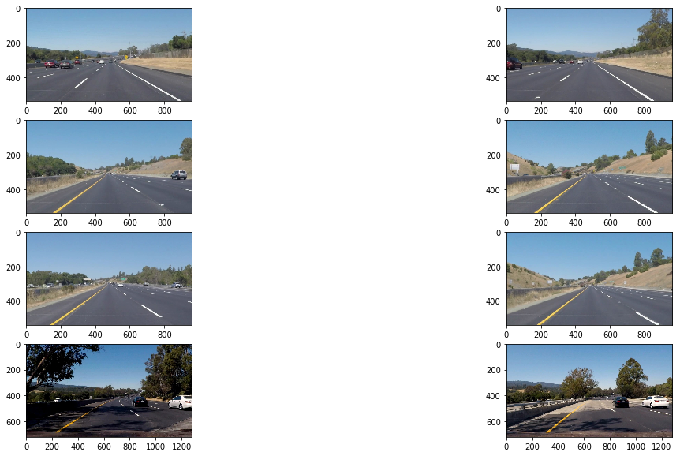
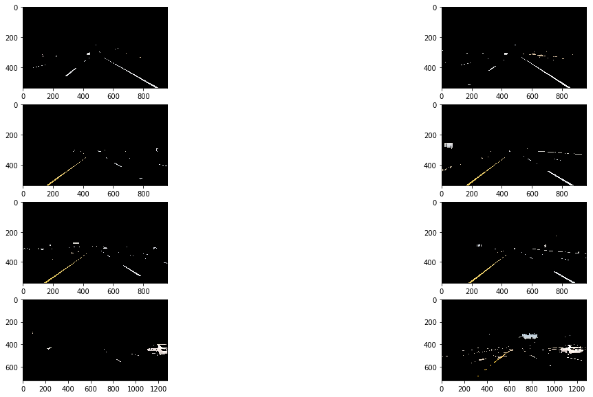
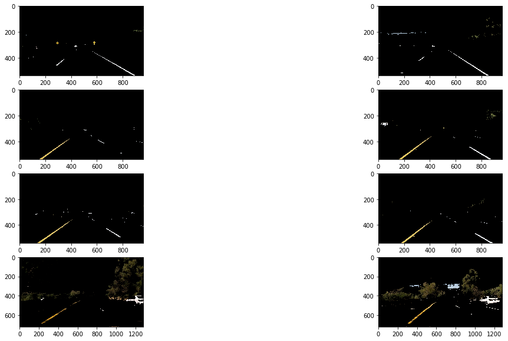
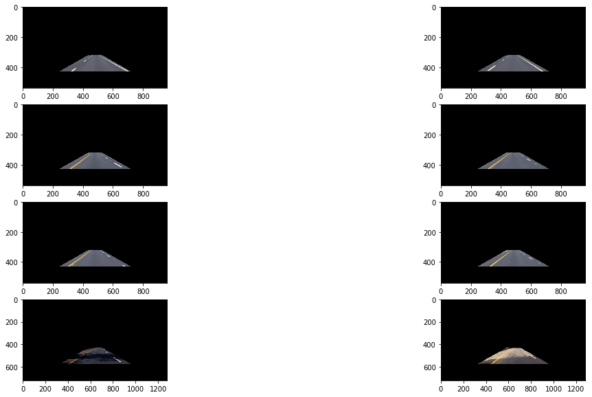
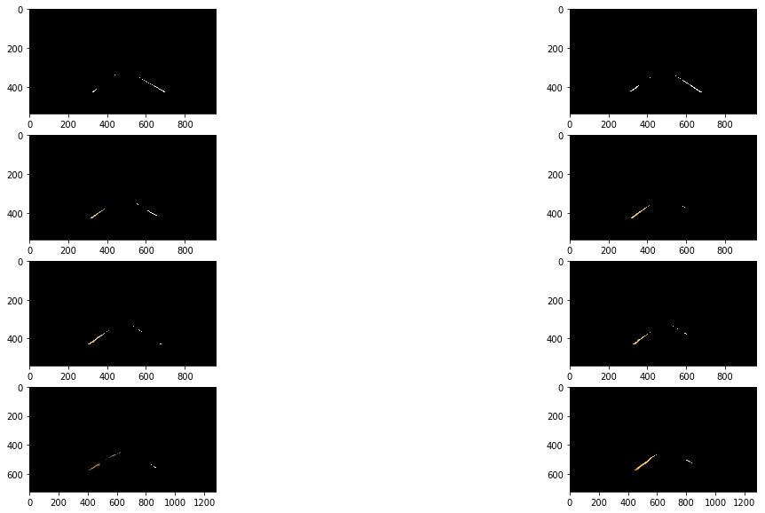
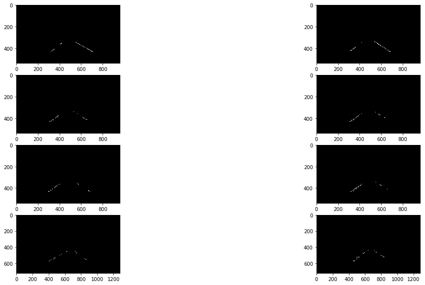
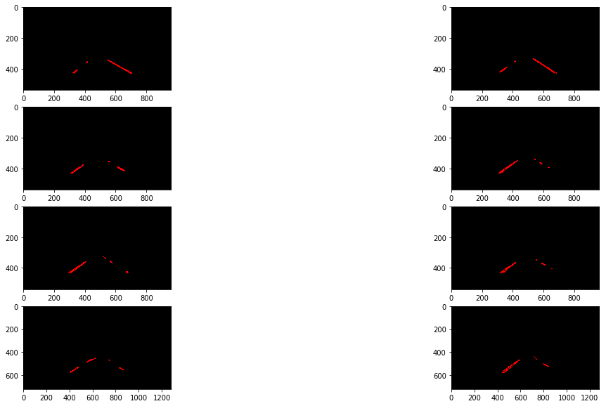
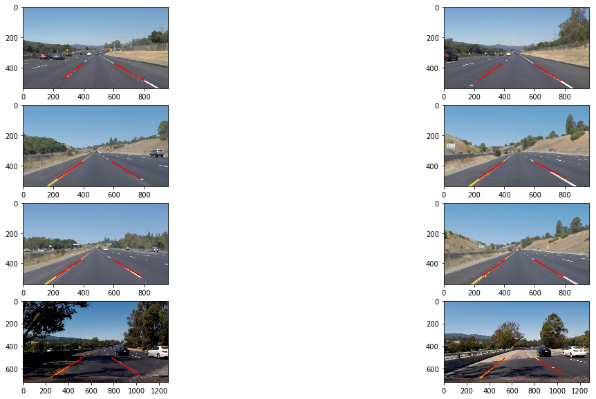

# **Finding Lane Lines on the Road**
## Finding lane lines on the road was accomplished by the following steps

1. Color Masking
2. Region Selection 
3. Detecting lines by Canny Line Detection on Hough Transform image
4. Separation of Left and Right Lane Lines and Linear Interpolation of Left and Right Lines.

---
<figure>

 <figcaption>
 

 
 
 Given Images: Last two images are challenge images because the consist of shadows and change in road color. 
 
 </figcaption>
</figure>

## Step 1: Color Masking 

There are two main colors which are used to paint the lane lines on the road 1) Yellow and 2) White. The lane lines can be identified by using color to select the pixels. 
First step is to try the RGB approach to selecting color. 

## Observations:
* The color selection works fairly well in the easy cases but fails in the challenge case (last two). This can be improved by 
using a color selection that is invariant of the luminance. 
* The color selection fails when there are other similarly color objects. This can be fixed by using a regions mask over road area of the image. 

## Using HSV color

HSV color space representation of color was designed to closely align with the way human vision perceives color making attributes. In this mode, hue is arranges in a radial slice around a central axis of neutral colors which ranges from black at the bottom, to white at the top. 

## Observations: 
* Using HSV filtering gives better results for the challenge cases .

## Step 2: Region Selection 
* The regions selection helps choose the trapezoidal area where there road is present.
* A small margin is added at the bottom to remove the car hood visible in the challenge images.

## Combining color masking with regions selection 

## Step 3: Detecting lines by Canny Line Detection on Hough Transform image
### Apply Canny Edge Detection: 
Applying canny edge detection to the results from the previous step gives the following result. You can notice we are able to see a distinct set of left and right lanes. 

### Apply Hough Transform 

## Step 4: Separation of Left and Right Lane Lines and Linear Interpolation to get Left and Right Lanes.

In this step the left and right lanes are binned into separate groups by looking at the slope. If the slope is negative we classify it as a left lane line and right lane otherwise. The left and right lane line slopes are averaged out to get a single left and right lane in slope and intercept form. 

### Results: 
Finally, the left and right lanes are are drawn as separate lines on the image. 

### Limitations of the method 

* Stability of lines detected:  As noticed in the video results, the lines are not stable from frame to frame, especially in the challenge case. 
* Color Masking: Since the lane lines are detected purely based on color, any additional object which is colored similar to the lane color will produce false positives. Further, change in weather and time of the day affect the result greatly. Lanes will not be detected if any other color than white and yellow is used. 
* Lane count: The method assumed a lane count of two and will fail during lane changes when there are multiple lanes visible. 

### Possible Improvements

* Use data from the previous frame to predict a region where the lanes are most likely to be. Kalman filtering should provide a more stable result.
* Occulding objects could be masked out to provide better lane detection.
* Multiple lanes in the field of view should be detected separately. 

